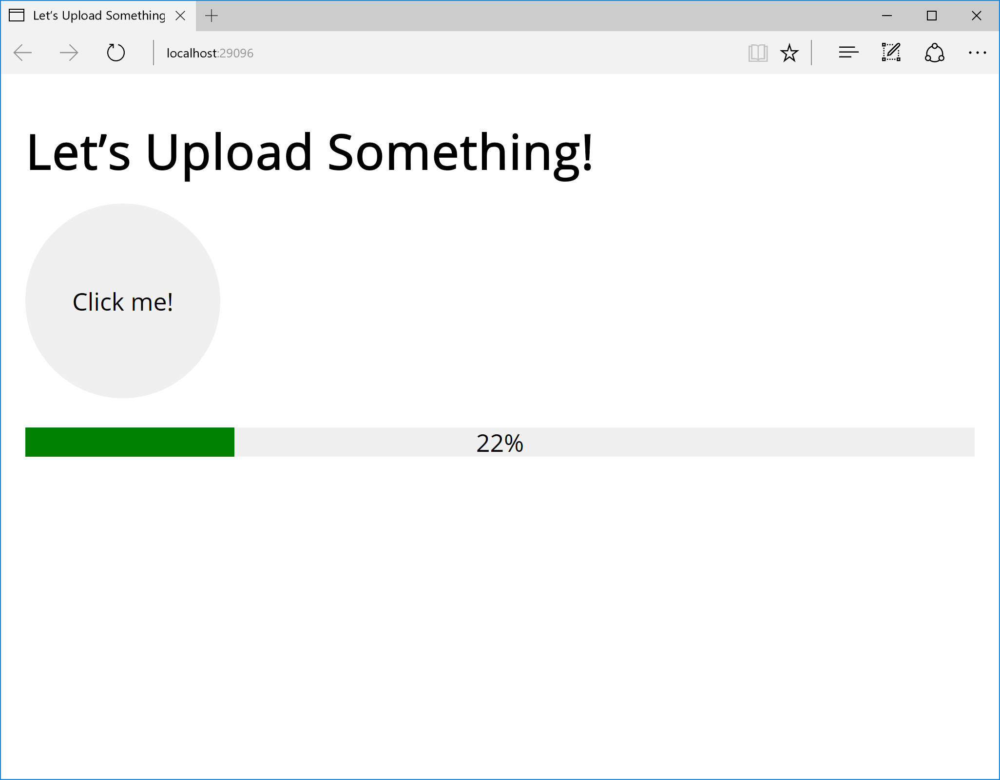

# File Uploading with Progress Bar in ASP.NET Core
This is a demo web application for the
“[File Uploading with Progress Bar in ASP.NET Core](https://medium.com/@dmitrysikorsky/file-uploading-with-a-progress-bar-in-asp-net-core-771c9580795f)”
post on the [Dmitry Sikorsky’s blog](https://medium.com/@dmitrysikorsky). It demonstrates how to upload files in ASP.NET Core
with a progress bar without using any third-party client side technology (like Flash).

The demo web application screenshot:

*Demo web application*

Updated to use .NET Core 2.0.
